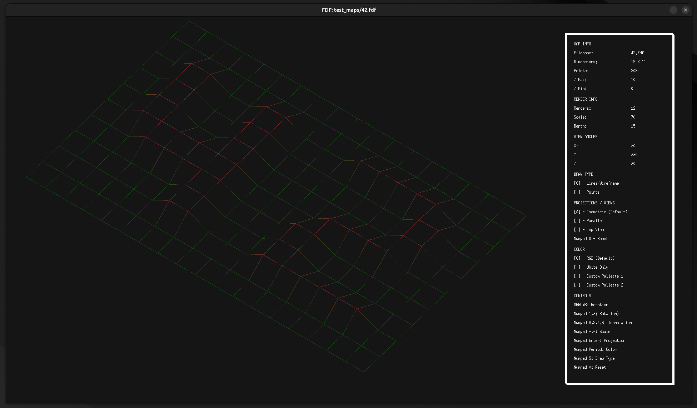
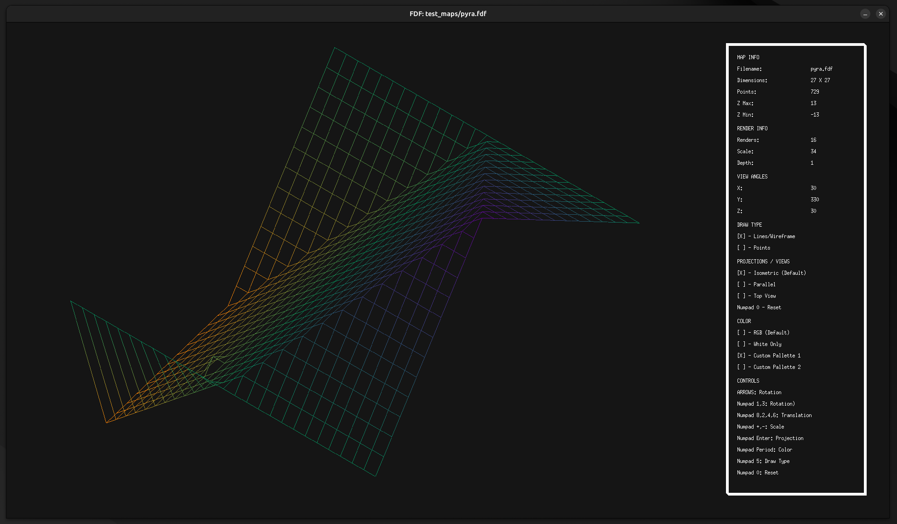
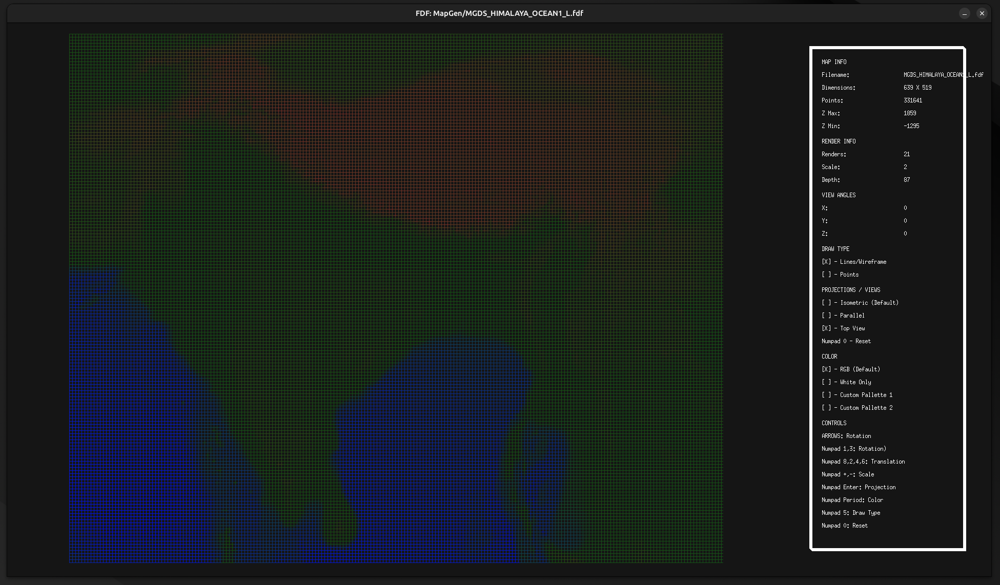
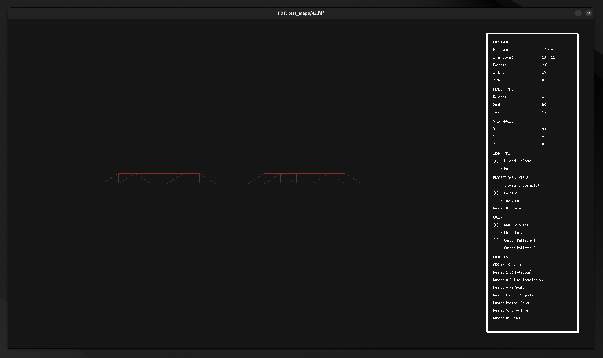

# FDF - Wireframe Map 



## Overview

FDF is a 3D wireframe visualization project that generates and renders terrain models using heightmaps. It is one the first graphics project (other option is so_long, a2D game project) of the 42 Network School curriculum and showcases 3D rendering and visualization techniques using only the MiniLibX graphical library.

## Features

- **3D Terrain Visualization**: Load and render maps in isometric (default), top-down, and parallel
- **Customizable Views**:
  - Rotate on X, Y, Z axes.
  - Change scale and depth.
  - Multiple color modes and palettes.
- **Input Controls**:
  - Interactive rotation, scaling, and translation.
  - Switch between projection views.
  - Toggle between line and point draw modes.

## Screenshots

### Isometric View


### Top-Down View


### Parallel View


## Controls

| Key           | Action                             |
|---------------|------------------------------------|
| **Arrows**    | Rotate view                       |
| **Numpad 1/3**| Rotate on Z axis                  |
| **Numpad 8/2**| Translate vertically              |
| **Numpad 4/6**| Translate horizontally            |
| **Numpad +/-**| Zoom in/out                       |
| **Numpad Enter** | Toggle projection (Isometric/Parallel) |
| **Numpad .**  | Change color palette              |
| **Numpad 5**  | Switch draw mode (Wireframe/Points) |
| **Numpad 0**  | Reset view                        |


## Map Format

The `.fdf` map files are simple text files where:
- Each line represents a row of points.
- Each value represents the Z-coordinate (height) of the point.
- Example:
```
0  0  0  0  0  0  0  0  0  0  0  0  0  0  0  0  0  0  0
0  0  0  0  0  0  0  0  0  0  0  0  0  0  0  0  0  0  0
0  0 10 10  0  0 10 10  0  0  0 10 10 10 10 10  0  0  0
0  0 10 10  0  0 10 10  0  0  0  0  0  0  0 10 10  0  0
0  0 10 10  0  0 10 10  0  0  0  0  0  0  0 10 10  0  0
0  0 10 10 10 10 10 10  0  0  0  0 10 10 10 10  0  0  0
0  0  0 10 10 10 10 10  0  0  0 10 10  0  0  0  0  0  0
0  0  0  0  0  0 10 10  0  0  0 10 10  0  0  0  0  0  0
0  0  0  0  0  0 10 10  0  0  0 10 10 10 10 10 10  0  0
0  0  0  0  0  0  0  0  0  0  0  0  0  0  0  0  0  0  0
0  0  0  0  0  0  0  0  0  0  0  0  0  0  0  0  0  0  0
```
In addition to the default maps included in the test_maps folder, you can create and download custom maps using the 42MapGenerator to further explore the capabilities of the FDF project.